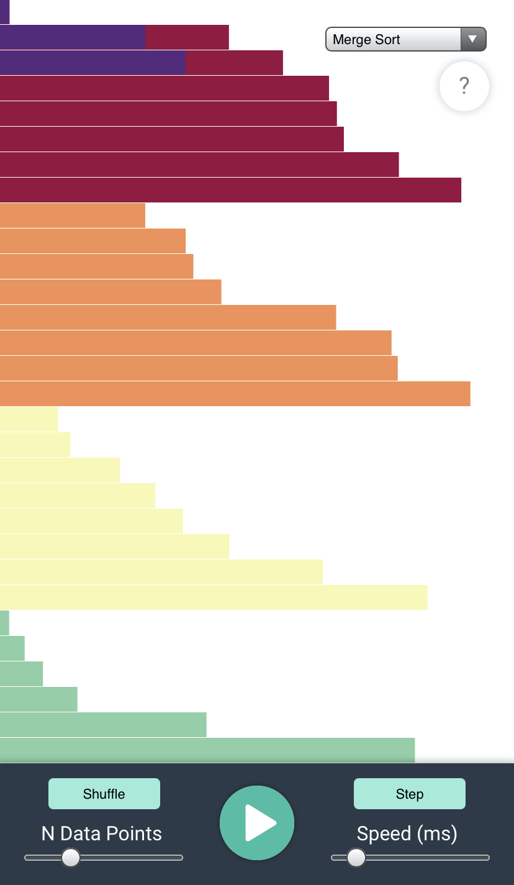

# sorting-visualizer

A web app that provides visual representations of different sorting algorithms.

I wanted to create something to practice my sorting algorithms, as well as to provide a learning tool to others who want to better understand sorting algorithms through visual animations.

## Check out the demo page

https://brancisco.github.io/sorting-visualizer

## Todo

- [ ] Add a modal view for each algorithm giving a brief explanation of how it works and its complexity overview.
- [ ] Add Quick Sort
- [ ] Add Selection Sort
- [ ] Add Heap Sort
- [ ] Add better sliders and buttons in toolbar.

Icons made by <a href="https://www.flaticon.com/authors/roundicons" title="Roundicons">Roundicons</a>, and <a href="" title="SumberRejeki">SumberRejeki</a> from <a href="https://www.flaticon.com/" title="Flaticon">www.flaticon.com</a>

